# 12장. 채팅 시스템 설계
- Whatsapp, Facebook messenger, Wechat, Line, Google Hangout, Discord와 같은 채팅 시스템 설꼐
### 1. 문제 이해 및 설계 범위 확정
- 설계하려는 채팅 앱 확정
  - 1:1 채팅이 주력인 앱: 페이스북 메신저, 위챗, 왓츠앱 등
  - 그룹 채팅이 주력인 업무용 앱: 슬랙 등
  - 대규모 그룹의 소통과 응답 지연(latency)이 낮은 음성 채팅이 주력인 앱: 디스코드 등
- 면접관과 확정하는 요구사항
  - 1:1 채팅과 그룹 채팅을 모두 지원하는 앱
  - 모바일 앱과 웹 앱 모두 지원
  - 처리해야 하는 트래픽 규모: 일별 능동 사용자 수(DAU: Daily Active User) 기준으로 5천만명
  - 그룹 채팅 인원 제한: 최대 100명
  - 주요 기능: 1:1 채팅, 그룹 채팅, 사용자 접속상태 표시, 텍스트 메시지만 주고받을 수 있음 (첨부파일은 x)
  - 메시지 길이 제한: 100,000자 이하
  - 종단 간 암호화(end-to-end encryption) 지원 여부 (이번 설계에서는 제외)
  - 채팅 이력은 영원히 보관
- 이 장에서 설계할 앱 기능: 페이스북 메신저와 유사한 채팅 앱
  - 응답 지연이 낮은 일대일 채팅 기능
  - 최대 100명까지 참여할 수 있는 그룹 채팅 기능
  - 사용자의 접속상태 표시 기능
  - 다양한 단말 지원. 하나의 계정으로 여러 단말에 동시 접속 지원
  - 푸시 알림
  - 5천만 DAU를 처리 가능 
### 2. 개략적 설계안 제시 및 동의 구하기
- 채팅 시스템의 클라이언트는 모바일 앱 또는 웹 애플리케이션
- 클라이언트끼리는 서로 직접 통신 x
- 각 클라이언트는 위의 기능을 지원하는 채팅 서비스와 통신
- 채팅 서비스가 지원해야 하는 기능
  - 클라이언트들로부터 메시지 수신
  - 메시지 수신자(recipient) 결정 및 전달
  - 수신자가 접속(online) 상태가 아닌 경우, 접속할 때까지 해당 메시지 보관
- 메시지 송신 클라이언트와 수신 클라이언트 - 채팅 서비스 관계
  - 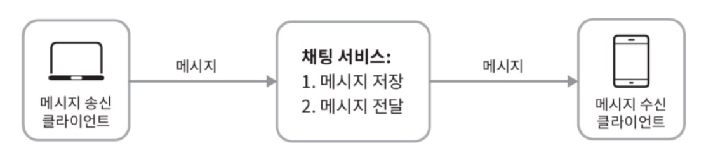
- 채팅 서비스에서 어떤 통신 프로토콜을 사용할 것인가?
  - 메시지 송신 프로토콜
    - 채팅을 시작하려는 클라이언트는 네트워크 통신 프로토콜을 사용하여 서비스에 접속해야 함
    - 위 그림에서 송신 클라이언트는 수신 클라이언트에게 전달할 메시지를 채팅 서비스에 보낼 때, HTTP 프로토콜 이용
      - 클라이언트가 채팅 서비스에 HTTP 프로토콜로 연결한 다음 메시지를 보내어 수신자에게 해당 메시지를 전달하라고 알림
      - 채팅 서비스와의 접속에는 keep-alive 헤더를 이용
        - 클라이언트와 서버 사이의 연결을 끊지 않고 계속 유지 가능
        - TCP 접속 과정에서 발생하는 핸드셰이크 횟수를 줄일 수 있음
      - HTTP는 메시지 전송 용도로는 괜찮음
      - 페이스북 같은 많은 대중적 채팅 프로그램이 초기에 HTTP를 차용함
  - 메시지 수신 프로토콜
    - HTTP는 클라이언트가 연결을 만드는 프로토콜이며, 서버에서 클라이언트로 임의 시점에 메시지를 보내는 데는 쉽게 쓰일 수 없음
    - 서버가 연결을 만드는 것처럼 동작할 수 있도록 하기 위해 사용하는 기법: 폴링, 롱 폴링, 웹소켓
    - 폴링
      - 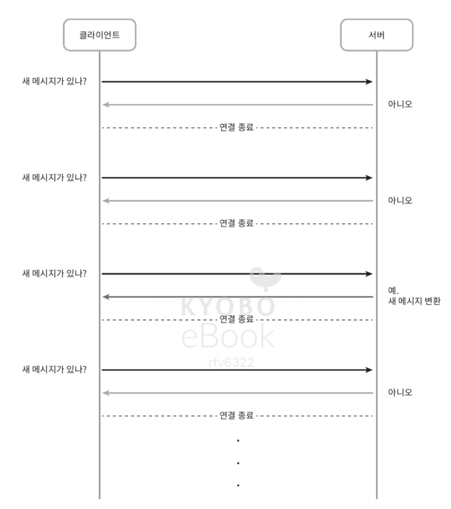
      - 클라이언트가 주기적으로 서버에게 새 메시지가 있느냐고 물어보는 방법
      - 폴링을 자주 할수록 폴링 비용 증가
      - 답해줄 메시지가 없는 경우에는 서버 자원이 불필요하게 낭비됨
    - 롱 폴링
      - 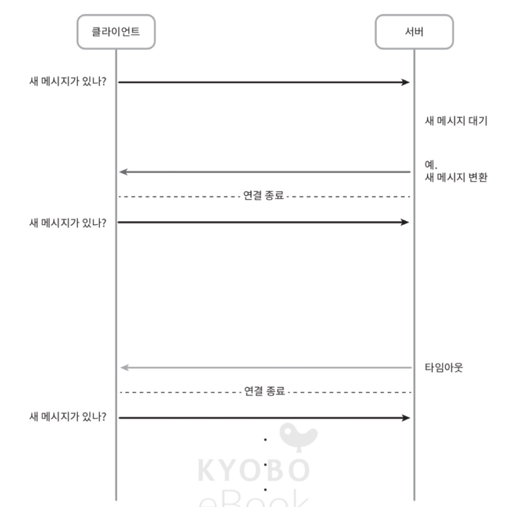
      - 폴링이 비효율적이어서 나온 기법
      - 클라이언트는 새 메시지가 반환되거나 타임아웃 될 때까지 연결 유지
      - 클라이언트는 새 메시지를 받으면: 기존 연결을 종료하고 서버에 새로운 요청을 보내어 모든 절차를 다시 시작
      - 단점
        - 메시지를 보내는 클라이언트와 수신하는 클라이언트가 같은 채팅 서버에 접속하게 되지 않을 수도 있음. 
          - HTTP 서버들은 보통 무상태(stateless) 서버: 로드밸런싱을 위해 라운드 로빈 알고리즘을 사용하는 경우, 메시지를 받은 서버는 해당 메시지를 수신할 클라이언트와의 롱 폴링 연결을 가지고 있지 않은 서버일 수 있음
        - 서버 입장에서는 클라이언트가 연결을 해제했는지 아닌지 알 좋은 방법이 없음
        - 비효율적임: 메시지를 많이 받지 않는 클라이언트도 타임아웃이 일어날 때마다 주기적으로 서버에 다시 접속해야 함
    - 웹소켓
      - 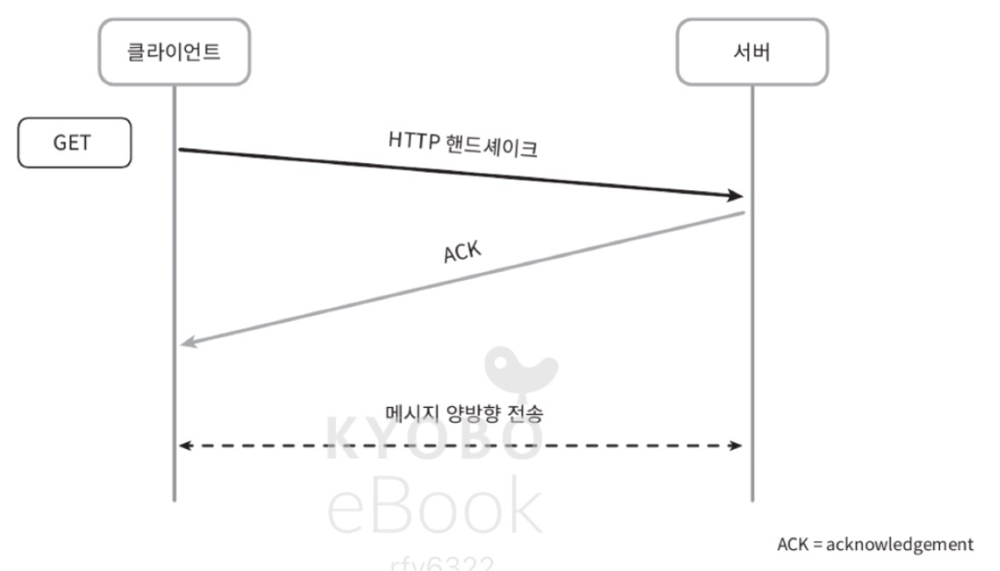
      - 서버가 클라이언트에게 비동기 메시지를 보낼 때 가장 널리 사용하는 기술
      - 웹소켓 연결은 클라이언트가 시작
      - 한번 맺어진 연결은 항구적이며 양방향
      - 처음에는 HTTP 연결이지만 특정 핸드셰이크 절차를 거쳐 웹소켓 연결로 업그레이드 됨
      - 이 항구적인 연결이 일단 만들어지고 나면 서버는 클라이언트에게 비동기적으로 메시지를 전송할 수 있음.
      - 웹소켓은 일반적으로 방화벽이 있는 환경에서도 잘 동작함: 80, 443처럼 HTTP 혹은 HTTPS 프로토콜이 사용하는 기본 포트번호를 그대로 쓰기 때문
      - HTTP v.s. 웹소켓
        - HTTP 프로토콜: 메시지를 보내려는 클라이언트에게 괜찮은 프로토콜
        - 웹소켓: 이에 더해, 양방향 메시지 전송까지 가능하게 함
        - -> 채팅 메시지 전송에 웹소켓 대신 HTTP를 사용할 이유가 없음
        - 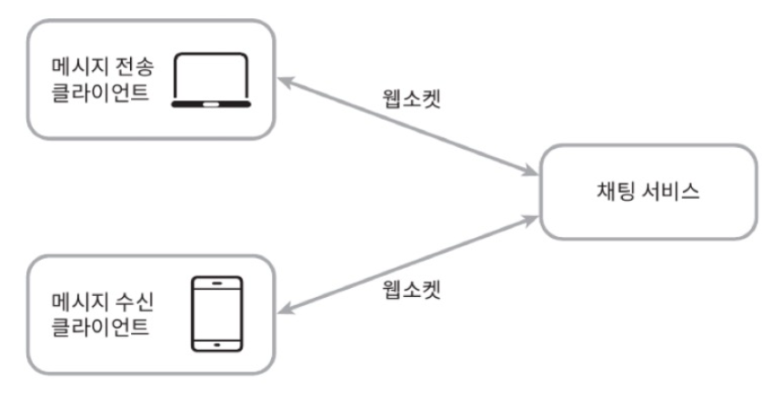
        - 웹소켓을 이용하면 메시지를 보낼 때나 받을 때 동일한 프로토콜을 사용할 수 있음 -> 설계와 구현이 단순하고 직관적
        - 유의사항: 웹소켓 연결이 항구적으로 유지되어야 하기 때문에, 서버 측에서 연결 관리를 효율적으로 해야 함
- 개략적 설계안
  - 클라이언트와 서버 사이의 주 통신 프로토콜: 웹소켓
  - 대부분의 다른 기능(회원가입, 로그인, 사용자 프로파일 등): 일반적인 HTTP
  - 채팅 시스템 세 부분으로 나누어: 무상태 서비스, 상태유지(stateful) 서비스, 제3자 서비스 연동
  - 무상태 서비스
    - 로그인, 회원가입, 사용자 프로파일 표시 등을 처리하는 전통적인 요청/응답 서비스
    - 무상태 서비스가 제공하는 기능은 많은 웹사이트와 앱이 보편적으로 제공하는 기능
    - 무상태 서비스는 로드밸런서 뒤에 위치
    - 로드밸런서: 요청을 그 경로에 맞는 서비스로 정확하게 전달
      - 로드밸런서 뒤에 오는 서비스는 모놀리틱 서비스일 수도 있고 마이크로서비스일 수도 있음
      - 이 서비스들 중 상당수가 시장에 완제품으로 나와 있기 때문에, 직접 구현하지 않아도 쉽게 사서 쓸 수 있음
        - 특히 '서비스 탐색(service discovery)' 서비스: 클라이언트가 접속할 채팅 서버의 DNS 호스트명을 클라이언트에게 알려주는 역할
  - 상태유지 서비스
    - 이 설계안에서 유일하게 상태 유지가 필요한 서비스는 채팅 서비스
    - 각 클라이언트가 채팅 서버와 독립적인 네트워크 연결을 유지해야 함
    - 클라이언트는 보통 서버가 살아있는 한 다른 서버로 연결을 변경하지 않음
    - 서비스 탐색 서비스는, 채팅 서비스와 긴밀히 협력하여 특정 서버에 부하가 몰리지 않도록 함
  - 제3자 서비스 연동
    - 채팅 앱에서 가장 중요한 제3자 서비스는 푸시 알림
    - 새 메시지를 받았다면, 설사 앱이 실행 중이지 않더라도 알림을 받아야 함
    - 제3장 "알림 시스템 설계" 참고
  - 규모 확장성
    - 트래픽 규모가 얼마 되지 않을 때는 위의 모든 기능을 서버 한대로 구현할 수 있음
    - 대량의 트래픽을 처리해야 하는 경우에도 이론적으로는 모든 사용자 연결을 최신 클라우드 서버 한 대로 처리할 수 있기는 함
      - 서버 한 대로 얼마나 많은 접속을 동시에 허용할 수 있느냐를 생각해야 함
      - 여기서 다루는 시스템은 동시 접속자가 1M이라고 가정: 접속당 10K의 서버 메모리가 필요하다고 본다면, 10GB 메모리만 있으면 모든 연결 처리 가능
      - 하지만 모든 것을 서버 한 대에 담은 설계안은 면접에서 좋은 점수를 받기는 힘듦: 누구도 그 정도 규모의 트래픽을 서버 한 대로 처리하지는 않을 것
        - 그 이유 중 하나로 SPOF(Single-Point-Of-Failure)
    - 서버 한 대만 갖는 설계안에서 출발하여 점차 다듬어 나가는 것은 괜찮음: '이것은 시작일 뿐'이라는 것만 면접관에게 명확하게 전달해 놓으면 괜찮음
  - 지금까지의 설계안
    - 
    - 주의: 실시간으로 메시지를 주고받기 위해, 클라이언트는 채팅 서버와 웹소켓 연결을 끊지 않고 유지한다는 것
    - 채팅 서버: 클라이언트 사이에 메시지를 중계
    - 접속상태 서버(presence server): 사용자의 접속 여부 관리
    - API 서버: 로그인, 회원가입, 프로파일 변경 등 그 외 나머지 전부를 처리
    - 알림 서버: 푸시 알림을 보냄
    - 키-값 저장소(key-value store): 채팅 이력(chat history) 보관. 시스템에 접속한 사용자는 이전 채팅 이력을 전부 볼 것
  - 저장소
    - 어떤 데이터베이스를 쓰느냐? 관계형데이터베이스 v.s. NoSQL
      - 데이터의 유형, 읽기/쓰기 연산의 패턴을 생각해 봐야 함
      - 채팅 시스템이 다루는 데이터
        1. 일반적인 데이터: 사용자 프로파일, 설정, 친구 목록 등 
           - -> 안정성을 보장하는 관계형 데이터베이스에 보관
           - 다중화(replication), 샤딩을 사용하여 해당 데이터의 가용성과 규모확장성을 보증함
        2. 채팅 시스템에 고유한 데이터: 채팅 이력(chat history)
           - 이 데이터를 어떻게 보관할지 결정하기 위해 읽기/쓰기 연산 패턴을 이해해야 함
             - 채팅 이력 데이터의 양은 엄청남: 페이스북 메신저, 왓츠앱은 매일 600억 개의 메시지를 처리
             - 이 데이터 가운데 빈번하게 사용되는 것은 주로 최근에 주고받은 메시지. 대부분의 사용자는 오래된 메시지는 확인하지 않음.
             - 사용자는 대체로 최근에 주고받은 메시지 데이터만 보게 되지만, 검색 기능 / 특정 사용자가 언급(mention)된 메시지 / 특정 메시지로 점프(jump) 등을 통해 무작위적인 데이터 접근을 하게 되는 일도 있음. 데이터 계층은 이런 기능도 지원해야 함
             - 1:1 채팅 앱의 경우 읽기:쓰기 비율은 대략 1:1
           - 이 조건을 만족하기 위한 데이터베이스로, 본 설계안에서는 키-값 저장소 활용
             - 키-값 저장소는 수평적 규모확장이 쉽다.
             - 키-값 저장소는 데이터 접근 지연시간(latency)이 낮음
             - 관계형 데이터베이스는, 데이터 가운데 롱 테일(long tail)에 해당하는 부분을 잘 처리하지 못함. 인덱스가 커지면 데이터에 대한 무작위적 접근을 처리하는 비용이 늘어남.
             - 이미 많은 안정적인 채팅 시스템이 키-값 저장소를 채택하고 있음 (페이스북: HBase, 디스코드: Cassandra)
  - 데이터 모델
    - 메시지 데이터를 어떻게 보관할 것인가?
    - 1:1 채팅을 위한 메시지 테이블
    - 
      - 기본키: message_id. 메시지 순서를 쉽게 정할 수 있도록 하는 역할도 담당
      - created_at을 사용하여 메시지 순서를 정할 수는 없음: 서로 다른 두 메시지가 동시에 만들어질 수도 있기 때문
    - 그룹 채팅을 위한 메시지 테이블
    - 
      - 기본키: (channel_id, message_id)의 복합 키
        - channel: 채팅 그룹과 같은 뜻
        - channel_id를 파티션 키로도 사용할 것인데, 그룹 채팅에 적용될 모든 질의는 특정 채널을 대상으로 할 것이기 때문
  - 메시지 ID
    - message_id는 메시지들의 순서도 표현할 수 있어야 함.
    - 그를 위해 다음과 같은 속성을 만족해야 함
      - message_id의 값은 고유해야 함 (uniqueness)
      - ID값은 정렬 가능해야 하며 시간 순서와 일치해야 함. 즉, 새로운 ID는 이전 ID보다 큰 값이어야 함
    - 이를 만족하려면...
      - RDBMS라면 auto_increment가 대안이 될 수 있겠지만 NoSQL은 그런 기능이 없음
      - 스노플레이크 같은 전역적 64-bit 순서 번호(sequence numbrer) 생성기를 이용 (제7장 "분산 시스템을 위한 유일 ID 생성기 설계")
      - 지역적 순서 번호 생성기(local sequence number generator)를 이용
        - local: ID의 유일성은 같은 그룹 안에서만 보증하면 충분하다는 뜻
          - 메시지 사이의 순서는 같은 채널, 혹은 같은 1:1 채팅 세션 안에서만 유지되면 충분하기 때문에...
          - 전역적 ID 생성기에 비해 구현하기 쉬운 접근법
### 3. 상세 설계
- 서비스 탐색(service discovery), 메시지 전달 흐름, 사용자 접속 상태 표시 방법을 상세 설계
- 서비스 탐색
  - 주된 역할: 클라이언트에게 가장 적합한 채팅 서버를 추천하는 것
    - 기준: 클라이언트의 위치(geographical locaion), 서버의 용량(capacity) 등
  - 서비스 탐색 기능 구현에 널리 쓰이는 오픈 소스 솔루션: 아파치 주키퍼(Apache Zookeeper)
    - 사용 가능한 모든 채팅 서버를 여기 등록해두고, 클라이언트가 접속을 시도하면 사전에 정한 기준에 따라 최적의 채팅 서버를 골라 줌
    - 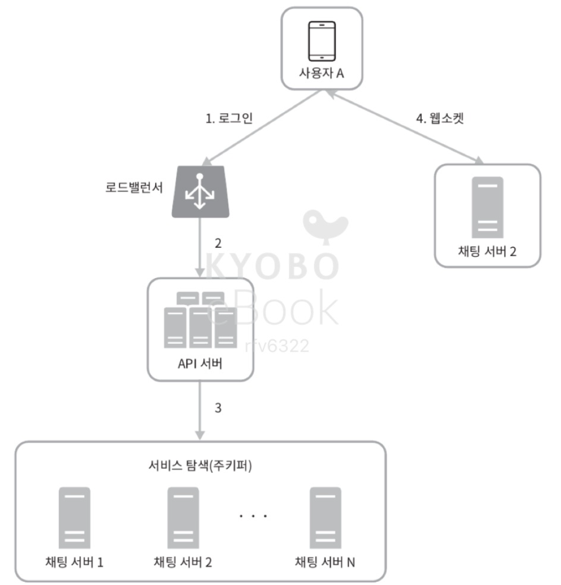
    - 주키퍼로 구현한 서비스 탐색 기능 동작
    - 1. 사용자 A가 시스템에 로그인 시도
    - 2. 로드밸런서가 로그인 요청을 API 서버들 가운데 하나로 전송
    - 3. API 서버가 사용자 인증을 처리하고 나면, 서비스 탐색 기능이 동작하여 해당 사용자를 서비스할 최적의 채팅 서버를 찾음. 이 예제의 경우, 채팅 서버 2가 선택되어 사용자 A에게 반환되었다고 하자.
    - 4. 사용자 A는 채팅 서버 2와 웹소켓 연결을 맺음.
- 메시지 흐름
  - 종단 간 메시지 흐름
  - 1:1 채팅 메시지의 처리 흐름
    - 
    - 1:1 채팅에서 사용자 A가 B에게 보낸 메시지가 어떤 경로로 처리되는 지를 나타내는 그림
    1. 사용자 A가 채팅 서버 1로 메시지 전송
    2. 채팅 서버 1은 ID 생성기를 사용해 해당 메시지의 ID 결정
    3. 채팅 서버 1은 해당 메시지를 메시지 동기화 큐로 전송
    4. 메시지가 키-값 저장소에 보관됨
    5. (a) 사용자 B가 접속 중인 경우, 메시지는 사용자 B가 접속 중인 채팅 서버(본 예제의 경우, 채팅 서버 2)로 전송됨. (b) 사용자 B가 접속 중이 아니라면, 푸시 알림 메시지를 푸시 알림 서버로 보냄
    6. 채팅 서버 2는 메시지를 사용자 B에게 전송. 사용자 B와 채팅 서버 2 사이에는 웹소켓 연결이 있는 상태이므로, 그것을 이용
  - 여러 단말 간 메시지 동기화 과정
    - 
    - 사용자 A는 전화기와 랩톱, 두 대의 단말을 이용. 사용자 A가 전화기에서 채팅 앱에 로그인한 결과로 채팅 서버 1과 해당 단말 사이에 웹소켓 연결이 만들어져 있고, 랩톱에서 로그인한 결과로 역시 별도 웹소켓이 채팅 서버 1에 연결되어 있는 상황
    - 각 단말은 cur_max_message_id라는 변수를 유지: 해당 단말에서 관측된 가장 최신 메시지의 ID를 추적하는 용도
    - 아래 두 조건을 만족하는 메시지는 새 메시지로 간주
      - 수신자 ID가 현재 로그인한 사용자 ID와 같다.
      - 키-값 저장소에 보관된 메시지로서, 그 ID가 cur_max_message_id보다 크다.
    - cur_max_message_id는 단말마다 별도로 유지관리하면 되는 값이라, 키-값 저장소에서 새 메시지를 가져오는 동기화 작업도 쉽게 구현 가능
  - 소규모 채팅 메시지의 처리 흐름
    - 
    - 사용자 A가 그룹 채팅 방에서 메시지를 보냈을 때 일어나는 일
    - 해당 그룹에 3명의 사용자가 있음(사용자 A, B, C)
    - 사용자 A가 보낸 메시지가 사용자 B와 C의 메시지 동기화 큐(message sync queue)에 복사됨.
      - 큐: 사용자 각각에 할당된 메시지 수신함
    - 이 설계안이 소규모 그룹 채팅에 적합한 이유:
      - 새로운 메시지가 왔는지 확인하려면 자기 큐만 보면 되니까 메시지 동기화 플로우가 단순
      - 그룹이 크지 않으면 메시지를 수신자별로 복사해서 큐에 넣는 작업의 비용이 문제가 되지 않음
    - 위챗이 사용하는 접근법. 그룹의 크기는 500명으로 제한
    - 많은 사용자를 지원해야 하는 경우라면 똑같은 메시지를 모든 사용자의 큐에 복사하는 것은 비용이 많이 듦
    - 위의 흐름을 수신자 관점에서 바라보면
      - 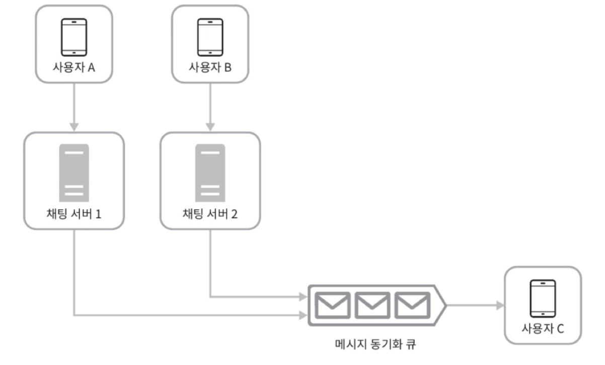
      - 한 수신자는 여러 사용자로부터 오는 메시지를 수신할 수 있어야 함.
      - 따라서 각 사용자의 수신함 (= 메시지 동기화 큐)은 위 그림과 같이 여러 사용자로부터 오는 메시지를 받을 수 있어야 함
- 접속상태 표시
  - 개략적 설계안에서, 접속상태 서버(presence sever)를 통해 사용자의 상태를 관리한다 했음.
  - 접속상태 서버는 클라이언트와 웹소켓으로 통신하는 실시간 서비스의 일부임.
  - 사용자가 상태가 바뀌는 시나리오
    - 사용자 로그인
      - 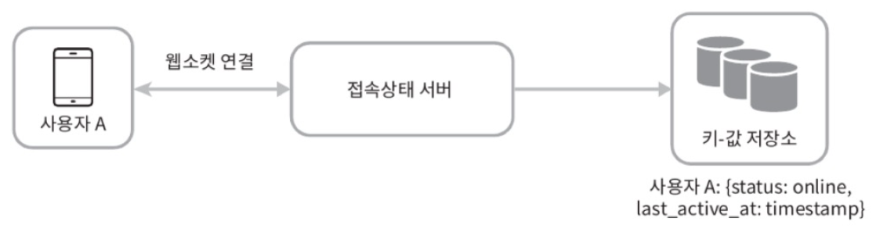
      - 클라이언트와 실시간 서비스(real-time service) 사이에 웹소켓 연결이 맺어짐 -> 접속상태 서버는 A의 상태와 last_active_at 타임스탬프 값을 키-값 저장소에 보관 -> 해당 사용자는 접속 중으로 표시됨.
    - 로그아웃
      - 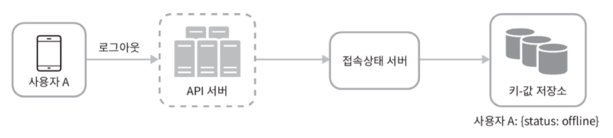
      - 키-값 저장소에 보관된 사용자 상태가 online -> offline으로 바뀜
      - -> UI 상에서 사용자의 상태가 접속 중이 아닌 것으로 표시됨
    - 접속 장애
      - 인터넷 연결이 불안정한 상황에 대응할 수 있는 설계 필요
      - 사용자의 인터넷 연결이 끊어지면, 클라이언트와 서버 사이 맺어진 웹소켓 같은 지속성 연결도 끊어짐
      - 이런 장애에 대응하려면, 사용자를 오프라인 상태로 표시하고, 연결이 복구되면 온라인 상태로 변경
      - 이 방법의 문제: 짧은 시간 동안 인터넷 연결이 끊어졌다 복구되는 일이 흔함 (터널 통과 등). 이럴 때마다 사용자 접속 상태 변경이 일어난다면 지나치고, UX 측면에서도 별로.
    - 이 설계안에서는 박동(heartbeat) 검사를 통해 이 문제를 해결함
      - 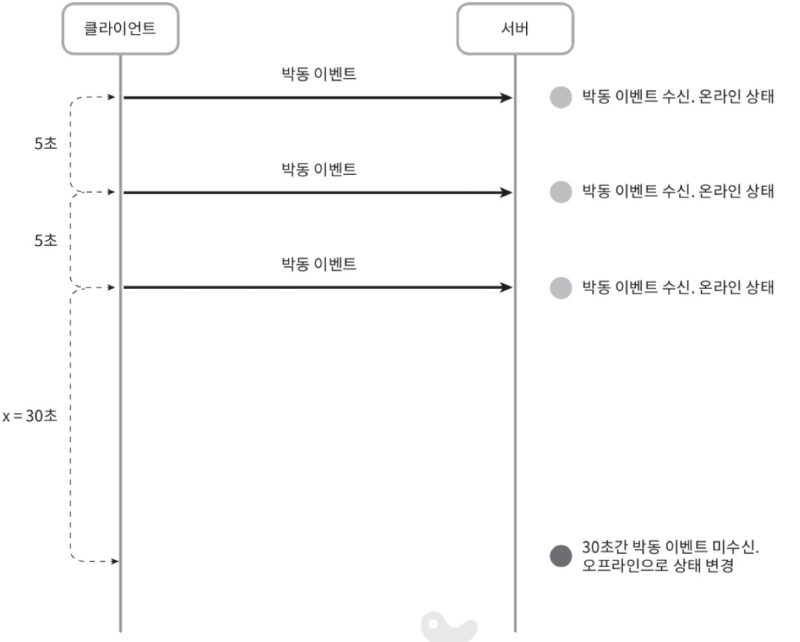
      - 온라인 상태의 클라이언트로 하여금 주기적으로 박동 이벤트(heartbeat event)를 접속상태 서버로 보내도록 하고, 마지막 이벤트를 받은 지 x초 이내에 또 다른 박동 이벤트 메시지를 받으면 해당 사용자의 접속 상태를 계속 온라인으로 유지, 그렇지 않을 경우에만 오프라인으로 바꿈
      - 위 예제의 클라이언트는 박동 이벤트를 매 5초마다 서버로 보냄.
      - 이벤트를 3번 보낸 후, x=30초 동안 아무런 메시지를 보내지 않음 -> 오프라인 상태로 변경
    - 상태 정보 전송
      - 사용자 A와 친구 관계에 있는 사용자들은 어떻게 해당 사용자의 상태 변화를 알게 되는가?
      - 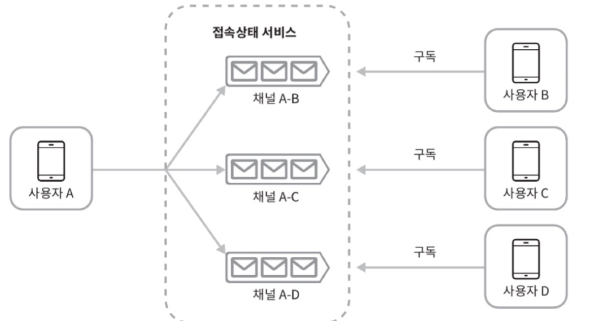
      - 상태정보 서버는 발행-구독 모델(publish-subscribe model)을 사용함: 각각의 친구관계마다 채널을 하나씩 두는 것
      - 사용자 A의 접속상태가 변경되었다면, 그 사실을 세 개 채널, 즉 A-B, A-C, A-D에 씀
      - A-B는 사용자 B가 구독하고, A-C는 사용자 C가, A-D는 사용자 D가 구독하도록 함
      - -> 친구 관계에 있는 사용자가 상태정보 변화를 쉽게 통지 받을 수 있게 됨. 클라이언트와 서버 사이의 통신에는 실시간 웹소켓 이용
      - 그룹 크기가 작을 때는 효과적인 방법 (위챗: 그룹 크기 상한이 500, 이와 유사한 접근법 사용 가능)
      - 그룹 크기가 커지면 이런 식으로 접속상태 변화를 알려서는 비용이나 시간이 많이 들게 됨.
        - 그룹 하나에 100,000 사용자가 있다면, 상태변화 1건당 100,000개의 이벤트 메시지가 발생할 것
        - 이런 성능 문제를 해소하는 방법
          - 사용자가 그룹 채팅에 입장하는 순간에만 상태 정보를 읽어가게 함
          - 친구 리스트에 있는 사용자의 접속상태를 갱신하고 싶으면 수동으로(manual) 하도록 유도
### 4. 마무리
- 1:1 채팅과 그룹 채팅을 전부 지원하는 채팅 시스템 아키텍처를 살펴봄
- 클라이언트-서버 실시간 통신을 위해 웹소켓 이용
- 주요 컴포넌트: 채팅 서버(실시간 메시징 지원), 접속 상태 서버, 푸시 알림 서버, 키-값 저장소(채팅 이력 보관), API 서버 (이를 제외한 나머지 기능 구현에 쓰임)
- 추가 논의 사항
  - 채팅앱 확장: 사진이나 비디오 등의 미디어를 지원하도록 하는 방법
    - 미디어 파일은 텍스트에 비해 크기가 큼
    - 압축 방식, 클라우드 저장소, 섬네일 생성 등에 대한 논의
  - 종단 간 암호화: 왓츠앱에서 지원
    - 메시지 발신인과 수신자 이외에는 아무도 메시지 내용을 볼 수 없음
  - 캐시: 클라이언트에 이미 읽은 메시지를 캐시해두면 서버와 주고받는 데이터 양을 줄일 수 있음.
  - 로딩 속도 개선: 슬랙은 사용자의 데이터, 채널 등을 지역적으로 분산하는 네트워크를 구축하여 앱 로딩 속도를 개선함
  - 오류 처리
    - 채팅 서버 오류: 채팅 서버 하나에 수십만 사용자가 접속해 있다면, 그런 서버 하나가 죽으면 서비스 탐색 기능(주키퍼 등)이 동작하여 클라이언트에게 새로운 서버 배정 및 재접속 지원해야 함
    - 메시지 재전송: 재시도나 큐는 메시지의 안정적 전송을 보장하기 위해 흔히 사용되는 기법임.