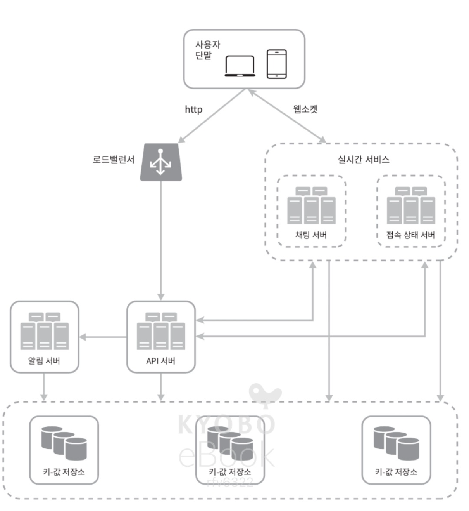
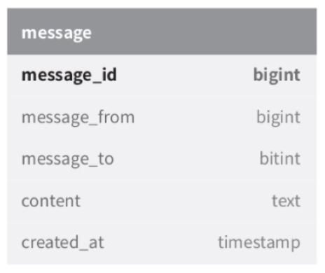
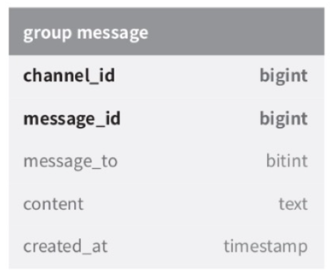
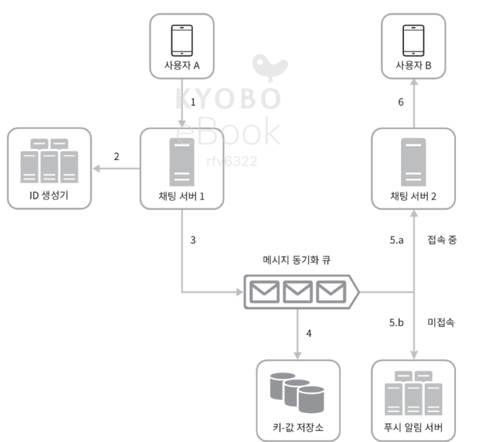
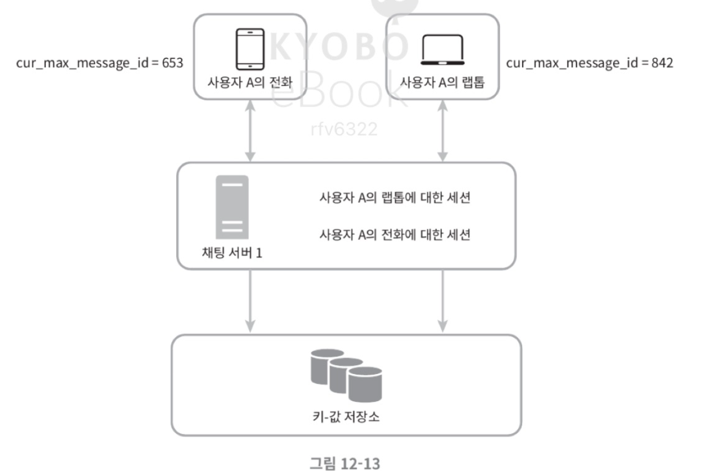
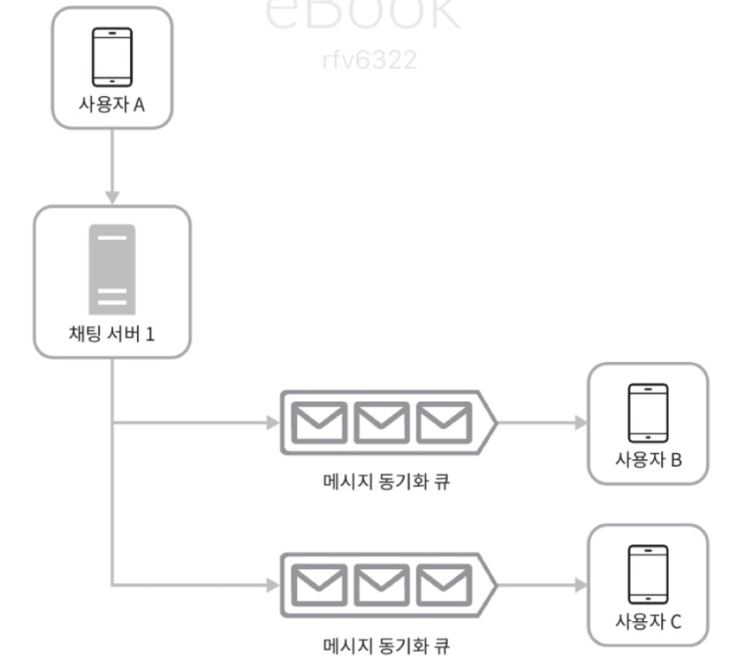

# 12장. 채팅 시스템 설계

## 1. 문제 이해 및 설계 범위 확정

채팅 시스템 설계는 어떤 유형의 애플리케이션을 만들 것인지 정의하는 것에서 시작한다.  
대표적으로는 1:1 채팅 중심 서비스(WhatsApp, Messenger), 그룹 협업형 서비스(Slack), 대규모 음성 채팅 중심 서비스(Discord) 등이 있다.

본 설계에서는 다음 요구사항을 만족하는 일반적인 채팅 애플리케이션을 가정한다.

- 1:1 채팅과 그룹 채팅을 모두 지원
- 모바일 앱과 웹 앱 모두 지원
- 일별 능동 사용자 수(DAU) 5천만 명
- 그룹 채팅 최대 인원 100명
- 텍스트 메시지 중심 (첨부파일 제외)
- 메시지 길이 제한: 100,000자 이하
- 채팅 이력은 영구 저장
- 사용자 접속 상태 표시 기능 제공
- 푸시 알림 지원
- 종단 간 암호화는 고려하지 않음

즉, 대규모 트래픽을 처리하면서 낮은 지연을 요구하는 실시간 채팅 시스템을 설계 대상으로 한다.

---

## 2. 개략적 설계안 제시 및 동의 구하기

### 2-1. 기본 구조

채팅 시스템에서 클라이언트는 서로 직접 통신하지 않고, 채팅 서비스를 통해 메시지를 주고받는다.

채팅 서비스의 주요 역할은 다음과 같다.

- 클라이언트로부터 메시지 수신
- 메시지 수신자 결정 및 전달
- 수신자가 오프라인일 경우 메시지 저장

---

### 2-2. 통신 프로토콜

채팅 시스템에서 중요한 설계 포인트는 메시지 송수신을 위한 프로토콜 선택이다.

#### 메시지 송신

- 클라이언트는 채팅 서버와 연결한 뒤 메시지를 전송
- 초기 연결에는 HTTP 사용 가능
- keep-alive를 통해 연결 유지 가능
- 초기 채팅 서비스들도 HTTP를 사용한 사례 존재

#### 메시지 수신

HTTP는 서버가 클라이언트로 임의 시점에 메시지를 보내기 어렵기 때문에 별도 방식이 필요하다.

- 폴링
  - 주기적으로 서버에 요청
  - 메시지가 없어도 요청 발생 -> 비효율

- 롱 폴링
  - 메시지 도착 또는 타임아웃까지 연결 유지
  - 여전히 재요청 필요, 서버 상태 관리 어려움

- 웹소켓
  - 클라이언트가 연결 시작
  - 연결이 유지되는 동안 양방향 통신 가능
  - 서버 -> 클라이언트 비동기 전송 가능
  - 방화벽 환경에서도 안정적으로 동작

결론:  
채팅 시스템에서는 웹소켓을 사용하는 것이 가장 적합하다.  
또한 웹소켓을 사용하면 송수신을 동일한 프로토콜로 처리할 수 있어 구조가 단순해진다.

---

### 2-3. 전체 시스템 구성

채팅 시스템은 다음 세 영역으로 나눌 수 있다.

#### 1) 무상태 서비스

- 로그인, 회원가입, 사용자 프로필 등 처리
- 일반적인 요청/응답 기반 서비스
- 로드밸런서 뒤에 위치하여 수평 확장 가능

#### 2) 상태 유지 서비스

- 채팅 서버가 해당됨
- 각 클라이언트와 지속적인 연결 유지 필요
- 사용자는 일반적으로 한 서버에 계속 연결 유지

#### 3) 제3자 서비스

- 대표적으로 푸시 알림 서비스
- 앱이 실행 중이 아니어도 메시지 수신 가능하도록 지원

---

### 2-4. 규모 확장성

초기에는 단일 서버로도 구현 가능하지만, 대규모 트래픽을 고려하면 다음 문제가 발생한다.

- SPOF(Single Point of Failure)
- 확장성 한계

따라서 실제 시스템은 여러 서버로 분산 구성해야 한다.

---

### 2-5. 저장소 설계

채팅 시스템의 데이터는 크게 두 가지로 나뉜다.

#### 1) 일반 데이터

- 사용자 정보, 설정, 친구 목록 등
- 관계형 데이터베이스 사용
- 복제 및 샤딩으로 확장

#### 2) 채팅 데이터

- 메시지 이력
- 매우 큰 데이터 규모
- 최근 데이터 중심 접근
- 낮은 지연 요구

-> 따라서 키-값 저장소(NoSQL) 사용

- 수평 확장 용이
- 빠른 읽기/쓰기
- 실제 사례: HBase, Cassandra

---

### 2-6. 데이터 모델

#### 1:1 채팅
- 
- 기본 키: message_id
- 메시지 순서 보장 역할

#### 그룹 채팅
- 
- 기본 키: (channel_id, message_id)
- channel_id를 파티션 키로 사용

---

### 2-7. 메시지 ID

메시지 ID는 다음 조건을 만족해야 한다.

- 고유성
- 시간 순 정렬 가능

가능한 방식:

- 전역 ID 생성기 (Snowflake)
- 채널 단위 로컬 ID 생성

-> 그룹/채널 내에서만 순서 보장하면 충분하므로 로컬 방식도 유효하다.

---

## 3. 상세 설계

### 3-1. 서비스 탐색

사용자가 접속할 채팅 서버를 선택하는 과정이 필요하다.

- 기준: 위치, 서버 부하 등
- 구현: Zookeeper 등

흐름:

1. 사용자 로그인
2. API 서버 인증 처리
3. 서비스 탐색을 통해 적절한 채팅 서버 선택
4. 클라이언트가 해당 서버와 WebSocket 연결

---

### 3-2. 메시지 전달 흐름

1:1 채팅 기준:
- 
1. 사용자 A -> 채팅 서버로 메시지 전송
2. 서버가 메시지 ID 생성
3. 메시지를 동기화 큐로 전달
4. 키-값 저장소에 저장
5. 수신자가 online이면 전달, 아니면 푸시 알림
6. 수신자에게 WebSocket으로 전달

-> 메시지 저장과 전달이 분리된 구조로 안정성 확보.

---

### 3-3. 다중 단말 동기화
- 
각 단말은 `cur_max_message_id`를 유지한다.

새 메시지 조건:

- 수신자 ID가 본인
- 메시지 ID가 기존 값보다 큼

-> 이를 통해 단말 간 메시지 동기화 구현

---

### 3-4. 그룹 채팅

소규모 그룹에서는 다음 방식 사용:
- 
- 메시지를 각 사용자 큐에 복사
- 각 사용자는 자신의 큐만 확인

장점:

- 단순한 구조
- 빠른 조회

단점:

- 그룹 규모가 커질수록 비용 증가

---

### 3-5. 접속 상태 표시

접속 상태는 실시간으로 관리된다.

#### 상태 변화

- 로그인 -> online
- 로그아웃 -> offline

#### 문제

- 네트워크 일시 끊김

#### 해결: Heartbeat

- 일정 주기로 신호 전송
- 일정 시간 미수신 시 offline 처리

#### 상태 전파

- Publish-Subscribe 모델 사용
- 친구 관계별 채널 구성
- 상태 변화 시 구독자에게 전달

단, 대규모 그룹에서는 비용 증가 문제가 발생할 수 있음.

- 성능 문제를 해소하는 방법
  - 사용자가 그룹 채팅에 입장하는 순간에만 상태 정보를 읽어가게 함
  - 친구 리스트에 있는 사용자의 접속상태를 갱신하고 싶으면 수동으로(manual) 하도록 유도

---

## 4. 마무리

핵심 구성 요소:

- WebSocket 기반 채팅 서버
- 접속 상태 서버
- 푸시 알림 서버
- 키-값 저장소 (채팅 이력)
- API 서버

추가적으로 고려할 수 있는 요소:

- 미디어 메시지 처리
- 종단 간 암호화
- 캐싱 전략
- 로딩 속도 개선
- 장애 대응 및 메시지 재전송